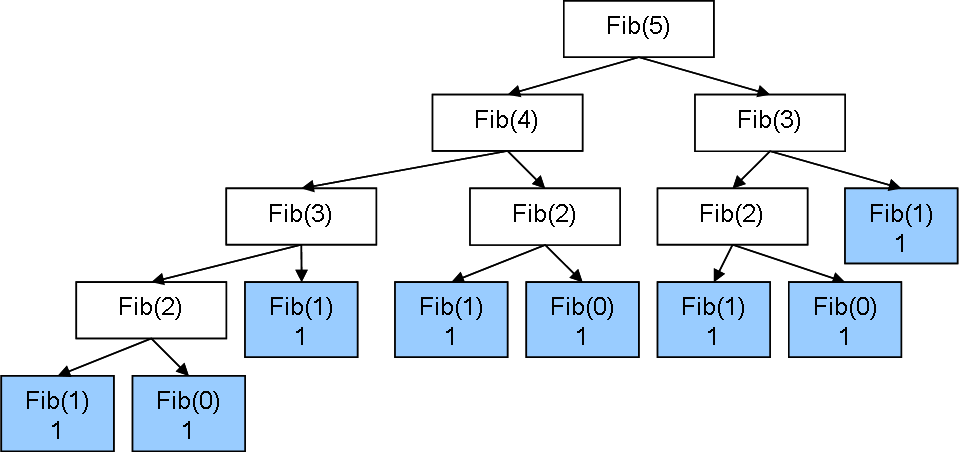

# Challenge 1
Calcularea `n`-ului termen Fibonacci este una dintre cele mai usoare lucruri pe care calculatoarele din ziua de azi le pot face.
Algoritmul de calcul, insa, influenteaza foarte mult timpul in care acest termen urmeaza sa fie calculat. Numarul de operatii
pe care un program in face pentru a ajunge la un rezultat se numeste **complexitate**, iar incadrarea unui algoritm intr-o clasa
de complexitate este esentiala pentru determinarea eficientei acestuia.

* In acest `challenge` vom studia efectele complexitatii asupra timpului de rulare.

## Fibonacci recursiv
  * Se foloseste formula matematica `fibo(n) = fibo(n-1) + fibo(n-2)`, cu `fibo(0) = fibo(1) = 1`.
  * Analiza acestui algoritm ii ofera de complexitate de `O(2^n)`.
  * Acest lucru se poate observa din arborele de mai jos, unde se evalueaza de mai multe ori aceeasi functie.
  
  
## Fibonacci iterativ
  * Se foloseste aceeasi formula matematica de mai sus doar ca se memoreaza valorile deja calculate.
  * Are o complexitate de `O(n)`.
## Fibonacci logaritmic
  * Foloseste doua principii importante:
    1. Ridicand o matrice particulara la puterea `n - 1` obtinem pe pozitia `(0, 0)` al `n`-lea termen Fibonacci.
    2. Ridicarea la putere se poate face in timp logaritmic folosind un algoritm recursiv. Mai multe detalii puteti gasi [aici](https://en.wikipedia.org/wiki/Exponentiation_by_squaring).
## Cerinta:
  * Completati codul si observati cat de mult dureaza sa ruleze cele 3 metode pentru al `40`-lea termen Fibonacci.
  * Observati cat dureaza sa se calculeze al `400.000.000`-lea termen Fibonacci pentru ultimele doua metode.
  * [ATENTIE] Intrucat aceste numere sunt foarte mari, ne va interesa doar restul impartirii la `666013`.

